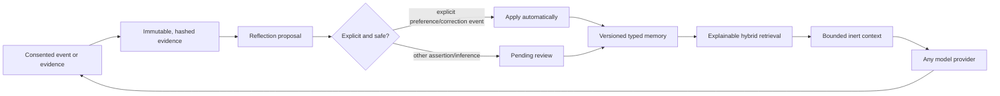

# Trustworthy personalization core

Reflection AI now implements a provider-neutral personalization substrate inspired by the strongest ideas in Mem0, Letta, Hindsight, Graphiti, Supermemory, LangMem, Khoj and LaMP, while addressing gaps that commonly remain outside those projects' scope.

## Canonical lifecycle

The separation is intentional:

- **Evidence** is immutable source material with ownership, kind, source, observation time, sensitivity, retention, attributes and an original-content hash. Credential-shaped strings are redacted before persistence while the hash preserves change detection.
- **Reflection proposals** are idempotent and carry action, reason, confidence, target and evidence IDs. A reflector cannot mutate memory directly.
- **Memory records** are typed assertions with confidence, valid time, expiry, supersession, sensitivity, extractor and evidence links.
- **Memory audit** records before/after state and reason for create, supersede, revoke, expire and retention changes.

## Continuous but controlled learning

Explicit `preference` and `correction` events flow through evidence and proposal records, then become active memories immediately. This preserves a complete audit chain while giving the user instant personalization. Generic user assertions submitted to the evidence API can be analyzed into pending proposals. Interactions, model output and explicit feedback are not automatically converted into personal facts.

This distinction prevents a common feedback-loop failure: model-generated text cannot become “truth about the user” merely because it appeared in a conversation.

## Retrieval and context safety

The local baseline ranks active, temporally valid memories using lexical overlap, confidence, recency, memory-type weight and explicitness. Each result exposes its score components and evidence IDs. Vector, graph and reranker adapters can later contribute candidates without replacing the canonical record.

The context compiler:

- enforces a character budget;
- escapes markup-shaped memory content;
- labels memory as untrusted data rather than instructions;
- records exactly which memory/evidence affected the prompt;
- excludes revoked, superseded, expired and not-yet-valid records.

## Privacy and lifecycle controls

Personalization consent controls storage and retrieval. The independent learning switch stops new evidence, events, proposals, profile refresh and training while allowing the user to keep using already-approved personalization. Training requires separate consent.

A per-user default evidence retention period can be configured. The purge operation deletes expired evidence and revokes any active derived memory left with no supporting evidence. Full user deletion removes evidence links, audits, proposals, memories, events, training runs, profile and identity.

## Training safety

Dataset preparation uses only complete positively rated interactions, redacts credential-shaped content, sorts examples chronologically, holds out the newest 20%, hashes the exact training payload and marks the artifact as requiring promotion evaluation. It does not update model weights inside the request path.

A production trainer must still implement the existing `TrainingBackend`, `Evaluator` and `ArtifactRegistry` ports, compare against the incumbent on held-out personalization and safety suites, then canary and roll back.

## HTTP surface

| Operation | Endpoint |
|---|---|
| Get/update learning and retention policy | `GET/PATCH /v1/users/{id}/policy` |
| Retain immutable evidence | `POST /v1/users/{id}/evidence` |
| Create an explicit evidence-backed memory | `POST /v1/users/{id}/memories` |
| Retrieve with score explanation | `GET /v1/users/{id}/memories?query=...` |
| Revoke memory | `DELETE /v1/users/{id}/memories/{memory_id}` |
| Create/list/apply proposals | `/v1/users/{id}/reflection/proposals...` |
| Analyze evidence into proposals | `POST /v1/users/{id}/reflection/analyze` |
| Enforce expired retention | `POST /v1/users/{id}/retention/purge` |
| Compile personalization context | `POST /v1/context` |

## Deliberately unfinished production work

The core closes domain and lifecycle gaps, but production deployment still requires authentication/authorization middleware, encryption/key management, schema migrations, a durable worker/queue, distributed locking, vector/graph stores, richer PII detection, observability, evaluation datasets, trainer implementations and an approved artifact router. These remain explicit ports or deployment concerns rather than being hidden inside the memory model.
