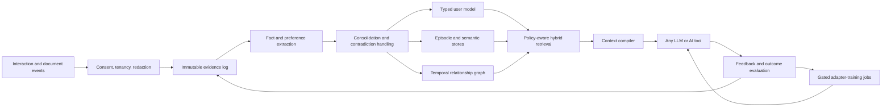

# Open-source personalization code index

This is the entry point for the Reflection AI source audit. The snapshot contains an exhaustive file-level index of 8 repositories: **8,462 tracked files**, **2,140,024 text lines**, and **66,341 detected declarations**. Every upstream snapshot is pinned to a commit. The reports explain the parts that materially affect personalized behavior; the TSV files retain the complete path, line, size, type, symbol, and content-hash index.

## How to use this audit

1. Open a repository's `SUMMARY.md` for the reviewed architecture and execution paths.
2. Use `manifest.tsv` to locate any tracked file and verify its SHA-256.
3. Use `line_index.tsv.gz` to verify every textual line by path, line number and content hash without copying upstream source.
4. Use `symbols.tsv` to locate a declaration and its upstream line number.
5. Use `relevant_files.tsv` as a high-recall shortlist; it is a filename-keyword index, not a quality judgment.
6. Use `directory_summary.tsv` to distinguish core code from tests, generated clients, examples, data, and UI.

Line counts are mechanical approximations. A prose sentence for every physical line would be less accurate than the source and would become obsolete at the next commit; this audit instead provides exhaustive machine-readable coverage and human review at module, class, function, data-flow, and reuse-decision level.

## Repository register

| Repository | Snapshot | Files | Text lines | Symbols | License | Primary lesson for Reflection AI |
|---|---:|---:|---:|---:|---|---|
| [Mem0](repos/mem0/SUMMARY.md) | `633b035` | 1,803 | 339,723 | 14,217 | Apache-2.0 | Fact extraction, scoped memory, vector retrieval, entities, provider adapters |
| [Letta](repos/letta/SUMMARY.md) | `b76da90` | 1,156 | 367,689 | 8,820 | Apache-2.0 | Bounded core-memory blocks and explicit agent memory tools |
| [Hindsight](repos/hindsight/SUMMARY.md) | `395823f` | 3,294 | 910,507 | 27,434 | MIT | Retain–recall–reflect, consolidation, mental models, temporal/entity reasoning |
| [Graphiti](repos/graphiti/SUMMARY.md) | `526dcad` | 352 | 156,973 | 2,539 | Apache-2.0 | Bi-temporal graph, provenance, contradiction invalidation, hybrid search |
| [Supermemory](repos/supermemory/SUMMARY.md) | `ef0026a` | 1,014 | 190,912 | 9,126 | MIT | Document ingestion product, memory relations, expiry and user-profile API patterns |
| [LangMem](repos/langmem/SUMMARY.md) | `a2d5809` | 91 | 36,064 | 319 | MIT | Hot-path tools, background reflection, structured extraction and namespaces |
| [Khoj](repos/khoj/SUMMARY.md) | `1e30154` | 701 | 133,097 | 3,613 | AGPL-3.0 | Full personal-assistant flow, opt-out controls, recent + semantic memory context |
| [LaMP](repos/lamp/SUMMARY.md) | `38c9d4d` | 51 | 5,059 | 273 | No root license found | Personalization benchmark, profile ranking, RAG/PEFT experiments |

## Combined architecture recommendation

The most important architectural decision is to keep **evidence**, **derived memory**, **retrieval**, **prompt behavior**, and **model training** separate. Memory can update continuously; model weights should update only through versioned datasets, privacy checks, offline evaluation, and rollback gates.

## Cross-repository conclusions

- Start with retrieval personalization. It is reversible, inspectable, works at cold start, and can serve any model.
- Store provenance and time on every derived assertion. A reflection engine without evidence cannot safely correct itself.
- Use typed memories: explicit facts, inferred preferences, episodic events, procedures, goals, relationships, and behavioral policies should not share one undifferentiated vector collection.
- Separate recent memory from long-term relevant memory, then compile both under a fixed token budget.
- Make create/update/delete/expire/restore first-class operations with audit history and user controls.
- Treat “reflection” as a constrained job that searches evidence, proposes changes, records confidence and reasons, and can be evaluated—not as unrestricted recursive prompting.
- Introduce PEFT only after per-user data sufficiency and measurable retrieval baselines exist. Never train directly on raw interactions in an unreviewed online loop.

See [REUSE_MATRIX.md](REUSE_MATRIX.md) for source-level decisions and [IMPLEMENTATION_BACKLOG.md](IMPLEMENTATION_BACKLOG.md) for the build sequence.
